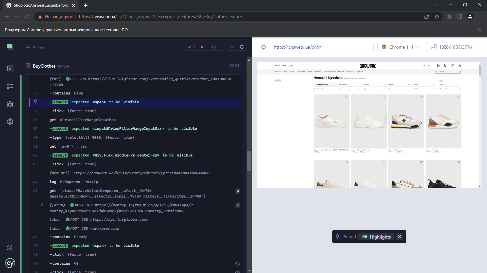

# Testing_Shop_Cucumber_Cypress
___

<!--   -->
      
**Testing_Shop_Cucumber_Cypress** - project about testing the web product using the Behavior Driven Development approach and it is currently in development.\
The task of the project is the application in automatic testing of tools from [Cucumber/Gherkin](https://cucumber.io/) and [Cyprecc](https://docs.cypress.io/guides/overview/why-cypress).\
[Cypress](https://docs.cypress.io/guides/overview/why-cypress) developers do not offer official reorganizations for [Cucumber](https://cucumber.io/) operation, but recommend using a coprocessor 
[cypress-cucumber-preprocessor](https://github.com/badeball/cypress-cucumber-preprocessor).
**Testing_Shop_Cucumber_Cypress** for testing used online store Answear.*, to which has no relation and choice 
It was purely accidental for the purity of the experiment.
+ The main objective of the project is a visual and accessible testing of the product for the customer. That is, according to a scenario understandable for the Customer, the Developer and QA, it is possible to check any endpoints of the product. The scenario changes - the test code does not change.
+ The second goal - the development of a template (behavior) automatic testing for similar products. 

It is possible that the author invents a bicycle, so would be grateful for any advice or assistance.

For illustrative purposes:                   

   

This is one of my first jobs as a QA machine. It does not carry a commercial load and is performed solely for the acquisition of skills.
